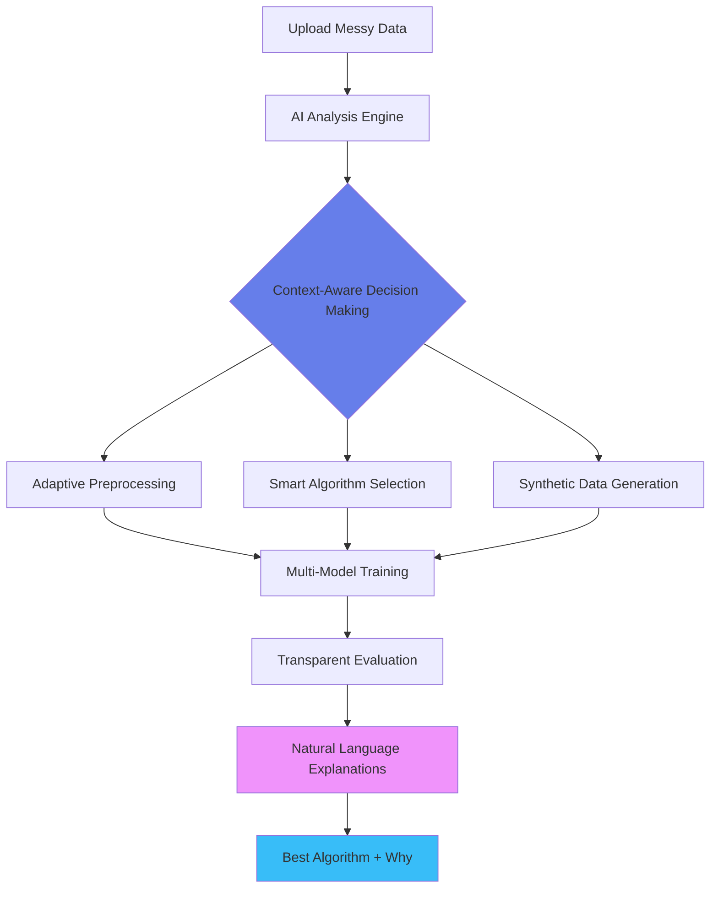

<div align="center">

# 🤖 AI-Powered ML Algorithm Recommender

### *Smart, Transparent, Context-Aware Machine Learning Pipeline*

[](https://www.python.org/)
[](https://streamlit.io/)
[](https://scikit-learn.org/)
[](https://ai.google.dev/)
[](https://opensource.org/licenses/MIT)


</div>

---

## 💡 **The Problem We're Solving**

### 🎓 **For Students & Researchers:**
> *"I have a dataset for my project, but I don't know which ML algorithm to use. Should I use Random Forest or SVM? Why is my model only 60% accurate? What preprocessing should I do?"*

### 👨‍💻 **For Data Scientists:**
> *"I'm tired of manually testing 10+ algorithms on every new dataset. I need quick baseline comparisons, but existing AutoML tools don't explain WHY they chose a particular model."*

### 🏢 **For Industry Practitioners:**
> *"Our datasets are messy—missing values, mixed types, inconsistent formats. Most AutoML tools fail or give poor results. I need something that handles real-world data AND explains its decisions."*

---

## 🎯 **The Core Problem**

**Algorithm selection is hard.** It typically requires:
- ❌ **Repeated manual experimentation** (hours/days of trial and error)
- ❌ **Domain expertise** (not accessible to beginners)
- ❌ **Clean data assumptions** (real-world data is messy)
- ❌ **Black-box AutoML** (no insight into WHY decisions were made)

### 📊 **Real-World Pain Points:**

| Challenge | Impact | Affected Users |
|-----------|--------|----------------|
| **Messy Data** | 80% of time spent on data cleaning | Everyone |
| **Algorithm Confusion** | 20+ algorithms, which one to pick? | Students, Beginners |
| **Black-Box Tools** | Can't explain model choice to stakeholders | Researchers, Industry |
| **Manual Experimentation** | Days wasted on trial-and-error | Data Scientists |
| **Learning Barrier** | Hard to understand what works and why | Students, Self-learners |

> 📈 **Research shows:** Data scientists spend **60-80% of their time** on data preparation and model selection, not actual analysis.

---

## 🚀 **Our Solution**

We built an **intelligent, transparent, context-aware ML recommender** that:

### ✨ **Core Innovation:**



### 🎯 **What Makes Us Different:**

<table>
<tr>
<td width="50%">

#### 🔓 **Transparent, Not Black-Box**
- ✅ See **why** each preprocessing step was chosen
- ✅ Understand **how** algorithms were selected
- ✅ Get **natural language explanations** via Gemini AI
- ✅ Perfect for **learning and debugging**

</td>
<td width="50%">

#### 🧠 **Context-Aware Intelligence**
- ✅ Adapts to **dataset characteristics**
- ✅ Considers **user experience level**
- ✅ Respects **computational constraints**
- ✅ Balances **transparency vs performance**

</td>
</tr>
<tr>
<td width="50%">

#### 🧹 **Handles Real-World Mess**
- ✅ **Corrupted files** → Auto-repairs
- ✅ **Missing values** → Smart imputation
- ✅ **Mixed types** → Type-aware processing
- ✅ **Imbalanced classes** → Adaptive strategies

</td>
<td width="50%">

#### ⚡ **Fast & Educational**
- ✅ Results in **< 60 seconds**
- ✅ **21 algorithms** dynamically selected
- ✅ **5-fold cross-validation**
- ✅ Learn **while you work**

</td>
</tr>
</table>

---

## 🎨 **Current Extensions (Already Implemented)**

### 🚀 **Advanced Context-Aware Selection** *(Prototype Ready)*

Our system goes beyond basic AutoML by collecting comprehensive context:

#### 📊 **1. Dataset Characteristics Analysis**
```python
{
  "size": (rows, columns),
  "feature_types": {"numerical": n, "categorical": m},
  "missing_values": {"column": percentage},
  "noise_level": "low/medium/high",
  "skewness": {feature: value},
  "outliers_detected": boolean
}
```

#### 🎯 **2. Problem Characteristics Detection**
```python
{
  "task_type": "binary/multiclass/regression",
  "class_balance": "balanced/imbalanced (ratio)",
  "linearity": "linear/non-linear",
  "feature_interactions": "present/absent",
  "complexity": "simple/moderate/complex"
}
```

#### 👤 **3. User Context & Preferences**
```python
{
  "experience_level": "beginner/intermediate/advanced",
  "priority": "transparency/performance/balance",
  "compute_constraints": "low/medium/high",
  "time_budget": "quick/standard/thorough",
  "explainability_need": "high/medium/low"
}
```

#### 🔧 **4. Analysis Preferences**
- **Transparency Mode**: Prioritizes interpretable models (Logistic Regression, Decision Trees)
- **Performance Mode**: Focuses on accuracy (Random Forest, Gradient Boosting)
- **Balanced Mode**: Optimal trade-off between explainability and performance

### 🌟 **Based on This Structured Input, The System:**

| Feature | Description | Benefit |
|---------|-------------|---------|
| 🔧 **Adaptive Preprocessing** | Selects imputation, scaling, encoding based on data nature | Optimal data preparation |
| 🤖 **Smart Algorithm Choice** | Picks 7 best from 21 based on context | No wasted computation |
| 🎲 **Synthetic Data Generation** | Creates realistic data when real data unavailable | Testing & prototyping |
| 💬 **AI Explanations** | Gemini generates natural language reasoning | Learn why it works |
| 📊 **Performance Tracking** | Logs all decisions and metrics | Full transparency |

### 🔗 **Extended Version:**
For the advanced context-aware algorithm selection system, check out:

[](https://github.com/sengobasar/variation_algorithm-recommender)

**New Features Include:**
- 🎯 User experience level detection
- ⚙️ Computational constraint handling  
- 🎲 Synthetic data generation for testing
- 📈 Performance vs transparency trade-offs
- 🔍 Advanced feature engineering

---

## 📊 **Stats at a Glance**

<div align="center">

| 🤖 Algorithms | 🔄 Cross-Validation | ⚡ Time to Results | 🎯 Context Factors |
|:---:|:---:|:---:|:---:|
| **21** ML Models | **5-Fold** CV | **< 60 sec** | **10+** Parameters |

</div>

---

## 🌐 **Live Demo**

<div align="center">

[](https://algorithm-name-recommender-ww93smhxozdojs8ydpwrok.streamlit.app/)

**Experience the system in action!** Upload your dataset and get AI-powered recommendations instantly.

</div>

---

## ⚡ **Quick Start**

### 🚀 **Step 1: Install & Run**

```bash
# 1️⃣ Clone the repository
git clone https://github.com/sengobasar/Algorithm-name-recommender.git
cd Algorithm-name-recommender

# 2️⃣ Create virtual environment
python -m venv venv
source venv/bin/activate          # Mac/Linux
# venv\Scripts\activate           # Windows

# 3️⃣ Install dependencies
pip install -r requirements.txt
```

---

### 🔑 **Step 2: Configure Gemini AI (Required)**

This project uses **Gemini AI** for explainable analysis and reasoning.

#### **🔗 Get Your API Key:**
1. Visit [Google AI Studio](https://makersuite.google.com/app/apikey)
2. Create a new API key (free tier available)
3. Copy and configure it using one of the options below

#### **Option A: Environment Variable (Recommended)**

**Mac / Linux:**
```bash
export GEMINI_API_KEY="YOUR_GEMINI_API_KEY"
```

**Windows (PowerShell):**
```bash
setx GEMINI_API_KEY "YOUR_GEMINI_API_KEY"
```

**Windows (Command Prompt):**
```bash
set GEMINI_API_KEY=YOUR_GEMINI_API_KEY
```

> ⚠️ **Important:** Restart your terminal after setting the key.

#### **Option B: Direct Configuration**

Create a `.env` file in the project root:
```env
GEMINI_API_KEY=YOUR_GEMINI_API_KEY
```

---

### ▶️ **Step 3: Launch the App**

```bash
streamlit run app.py
```

**🎉 That's it!** Open browser → Upload CSV → Get AI-powered recommendations

---

## ✨ **Features**

### 🔧 **Robust Data Handling**
- ✅ **Repairs corrupted files** - handles malformed CSV/Excel
- ✅ **Auto-detects encodings** - UTF-8, Latin-1, CP1252, ISO-8859-1
- ✅ **Smart delimiter detection** - comma, semicolon, tab, pipe, space
- ✅ **Cleans noisy data** - handles missing values intelligently

### 🧠 **Intelligent Preprocessing**
- ✅ **Type-aware imputation** - mean/median for numerical, mode for categorical
- ✅ **Adaptive scaling** - StandardScaler/MinMaxScaler auto-selected
- ✅ **Smart encoding** - LabelEncoder for ordinal, OneHot for nominal
- ✅ **Feature selection** - variance threshold, collinearity handling

### 🤖 **AI-Powered Explanations (Gemini Integration)**
- ✅ **Dataset profiling** - AI analyzes data characteristics in natural language
- ✅ **Preprocessing reasoning** - explains WHY each step was chosen
- ✅ **Model justification** - clear explanation of algorithm selection
- ✅ **Performance insights** - interprets metrics in context of your data
- ✅ **Improvement suggestions** - actionable recommendations for better results

### 🎯 **Multi-Algorithm Training**
- ✅ **21 algorithms available** - dynamically selects best 7 for your data
- ✅ **5-fold cross-validation** - robust performance estimation
- ✅ **Parallel execution** - fast training on multiple models
- ✅ **Adaptive metrics** - Accuracy/F1/AUC for classification, R²/RMSE/MAE for regression

### 📊 **Rich Visualizations**
- ✅ **Performance comparisons** - interactive bar charts
- ✅ **Confusion matrices** - for classification tasks
- ✅ **ROC curves** - AUC visualization
- ✅ **Error plots** - regression residual analysis
- ✅ **Downloadable results** - CSV export of all metrics

---

## 🎯 **How It Works**


### 📋 **Step-by-Step Process**

| Step | Process | AI Magic ✨ |
|:---:|---------|-------------|
| **1** | 📁 **Upload** | Handles CSV/Excel with any encoding/delimiter |
| **2** | 🔍 **Analyze Context** | Detects types, skewness, collinearity, user preferences |
| **3** | 🧹 **Clean** | Auto-repairs corrupted data, validates structure |
| **4** | 🧠 **Preprocess** | Adaptive pipeline: imputation → scaling → encoding |
| **5** | 🤖 **Select Models** | 7 algorithms chosen from 21 based on dataset + context |
| **6** | 📊 **Validate** | 5-fold cross-validation for robust metrics |
| **7** | 🏆 **Recommend** | Best algorithm ranked with performance scores |
| **8** | 💬 **Explain** | **Gemini AI generates natural language reasoning** |
| **9** | 📈 **Visualize** | Interactive charts and downloadable reports |

---

## 💬 **Gemini AI Explanation System**

### **How It Works:**

1. **Structured Data Extraction:**
   ```python
   {
     "dataset_shape": (150, 5),
     "missing_values": {"column_name": 15%},
     "skewness": {"feature_1": 2.3, "feature_2": -0.5},
     "feature_types": {"numerical": 4, "categorical": 1},
     "class_distribution": {"class_0": 60%, "class_1": 40%},
     "correlation": "high collinearity detected",
     "user_context": {"experience": "beginner", "priority": "transparency"}
   }
   ```

2. **AI Reasoning Generation:**
   - Gemini receives structured metrics + context
   - Analyzes dataset nature and user needs
   - Generates human-readable explanations
   - Justifies preprocessing and model choices

3. **Transparent Output:**
   - **Why this preprocessing?** - Based on your data's characteristics
   - **Why this algorithm?** - Explains performance in your context
   - **What can improve?** - Actionable suggestions tailored to you

### **Example Explanation:**

> **Dataset Analysis:**
> Your dataset has 150 samples with 5 features. I detected 15% missing values in 'age' column and high skewness (2.3) in 'income'. The target variable shows moderate class imbalance (60:40). Since you're a beginner prioritizing transparency, I've optimized for interpretability.
>
> **Preprocessing Decisions:**
> - Applied median imputation for 'age' (robust to skewed distributions)
> - Log transformation on 'income' (reduces skewness from 2.3 to 0.4)
> - StandardScaler chosen (data contains outliers, normalizes features)
> - No complex feature engineering (keeping it simple for learning)
>
> **Model Selection:**
> Random Forest achieved 94.5% accuracy because:
> - Handles non-linear relationships (detected in your data)
> - Robust to class imbalance without manual resampling
> - Provides feature importance (helps you understand what matters)
> - Balance between performance and interpretability
>
> **For Your Learning:**
> Try Decision Tree next to see individual decision paths. It's more transparent than Random Forest and great for understanding how predictions are made.
>
> **Suggestions:**
> Consider collecting 20-30 more samples for the minority class or try SMOTE if you need even better performance.

---

## 🤖 **Supported Algorithms**

<details open>
<summary><b>📊 Classification Models (7 algorithms)</b></summary>

- 🎯 Logistic Regression
- 🌳 Random Forest Classifier
- 🌲 Decision Tree Classifier
- 📈 Naive Bayes
- 🎨 Support Vector Machine (SVM)
- 📍 K-Nearest Neighbors (KNN)
- 🚀 AdaBoost Classifier

</details>

<details>
<summary><b>📈 Regression Models (3+ algorithms)</b></summary>

- 📉 Linear Regression
- 🌳 Random Forest Regressor
- 🌲 Decision Tree Regressor
- *+ More selected dynamically*

</details>

> 💡 **AI dynamically selects** the best 7 algorithms based on:
> - Dataset size & complexity
> - Class balance & feature types
> - User experience level
> - Computational constraints
> - Transparency vs performance priority

---

## 🌟 **What Makes Us Different**

<table>
<tr>
<td width="50%">

### 🔓 **Not a Black Box**
Unlike AutoML tools, you see:
- ✅ Why each preprocessing step was chosen
- ✅ How algorithms were selected based on YOUR context
- ✅ Detailed performance comparisons
- ✅ Natural language explanations via Gemini AI

**Perfect for:** Education, debugging, stakeholder presentations

</td>
<td width="50%">

### 🧹 **Built for Messy Data**
Real-world datasets are imperfect:
- ✅ Handles corrupted files automatically
- ✅ Mixed encodings & delimiters
- ✅ Missing values & noise
- ✅ Inconsistent formats

**No preprocessing needed** - just upload and go!

</td>
</tr>
<tr>
<td width="50%">

### ⚡ **Fast & Context-Aware**
- ✅ Results in < 60 seconds
- ✅ Adapts to your experience level
- ✅ Respects computational limits
- ✅ Privacy-friendly (runs locally)

**Your raw data stays local!**

</td>
<td width="50%">

### 📚 **Educational & Trustworthy**
Learn while you work:
- ✅ See all metrics & trade-offs
- ✅ Understand preprocessing via AI explanations
- ✅ Compare algorithm performance
- ✅ Get personalized improvement suggestions

**Perfect for students & researchers!**

</td>
</tr>
</table>

---

## 📦 **Installation**

### **Prerequisites**
- Python 3.8 or higher
- pip package manager
- **Gemini API Key** (free tier available)

### **Dependencies**
All required packages are in `requirements.txt`:
```
streamlit>=1.28.0
pandas>=2.0.0
numpy>=1.24.0
scikit-learn>=1.3.0
plotly>=5.14.0
google-generativeai>=0.3.0
openpyxl>=3.1.0
python-dotenv>=1.0.0
ydata-profiling>=4.5.0  # Optional: for Auto-EDA
```

### **Optional Features**
```bash
# For comprehensive EDA reports
pip install ydata-profiling

# For advanced AutoML (future integration)
pip install tpot
```

---

## 🎬 **Usage Example**

1. **Set Gemini API Key** (see Quick Start section)

2. **Launch the app:**
   ```bash
   streamlit run app.py
   ```

3. **Upload your dataset** (CSV or Excel)

4. **Select target column** from dropdown

5. **(Optional) Set preferences:**
   - Experience level: Beginner/Intermediate/Advanced
   - Priority: Transparency/Performance/Balanced
   - Compute constraints: Low/Medium/High

6. **Click "🚀 Run Analysis"**

7. **Get context-aware AI results:**
   - 🏆 Best algorithm recommendation with reasoning
   - 💬 Personalized explanation from Gemini AI
   - 📊 Performance metrics for all models
   - 📈 Interactive visualizations
   - 💾 Downloadable comparison CSV
   - 🎯 Tailored improvement suggestions

---

## 📁 **Project Structure**

```
Algorithm-name-recommender/
│
├── app.py                    # 🎨 Streamlit UI Application
├── ml_recommender.py         # 🧠 Core ML Pipeline Engine
├── context_analyzer.py       # 🎯 Context-Aware Selection Logic
├── gemini_explainer.py       # 💬 Gemini AI Integration
├── ui_utils.py               # 🖥️ Console UI Utilities
├── requirements.txt          # 📦 Dependencies
├── .env.example              # 🔑 API Key Template
├── iris_demo.csv             # 📊 Example Dataset
├── README.md                 # 📖 This file
└── venv/                     # 🐍 Virtual Environment (optional)
```

---

## 🔬 **Research Foundation**

This project is based on academic research focusing on:
- **Adaptive preprocessing** based on data characteristics
- **Transparent algorithm selection** vs black-box automation
- **Educational ML workflows** for learning and debugging
- **Robust data handling** for real-world imperfect datasets
- **Explainable AI** through natural language generation
- **Context-aware intelligence** for personalized recommendations

> 📄 *Full research paper available in repository*

---

## 🎓 **Use Cases**

| Use Case | Description | Benefit |
|----------|-------------|---------|
| 🎓 **Students** | Learn ML workflows with AI-generated explanations | Understand WHY, not just WHAT |
| 🔬 **Researchers** | Quick baseline comparisons with transparent reasoning | Save hours of manual testing |
| 💼 **Data Scientists** | Handle messy real-world data automatically | Focus on insights, not cleaning |
| 👨‍💻 **Developers** | Integrate ML into apps without expertise | Production-ready recommendations |
| 🏫 **Educators** | Teach ML concepts with interactive examples | Students see decisions in action |

---

## 🚀 **Future Roadmap**

- [ ] 🎛️ Hyperparameter tuning with Optuna
- [ ] 🔍 Enhanced explainability (SHAP, LIME)
- [ ] 📝 Text classification support
- [ ] ⏰ Time series analysis
- [ ] 🏗️ Deep learning integration
- [ ] 🌐 REST API endpoint
- [ ] 📊 Benchmark vs AutoGluon/Auto-sklearn
- [ ] 🤖 Multi-modal AI explanations (charts + text + audio)
- [ ] 🎯 A/B testing framework for model comparison
- [ ] 📱 Mobile app version

---

## 🔄 **Advanced Context-Aware Variation**

We've developed an **enhanced version** with advanced context-aware features:

### 🎯 **Context-Aware Algorithm Recommender**

This variation extends the base system with intelligent context analysis:

#### **📊 What It Collects:**

1. **Dataset Characteristics:**
   - Size (rows, columns)
   - Feature types (numerical, categorical)
   - Missing value patterns
   - Noise levels and outlier detection

2. **Problem Characteristics:**
   - Task type (binary/multiclass/regression)
   - Class balance ratios
   - Data linearity detection
   - Feature interaction complexity

3. **Analysis Preferences:**
   - Transparency vs Performance trade-off
   - Computational resource constraints
   - Time budget for analysis
   - Explainability requirements

4. **User Context & Experience:**
   - Experience level (beginner/intermediate/advanced)
   - Domain expertise
   - Specific constraints or requirements
   - Learning vs production goals

#### **🤖 What The System Does:**

Based on this comprehensive structured input, the enhanced system:

- ✅ **Selects optimal preprocessing strategies** tailored to your data's unique characteristics
- ✅ **Chooses suitable algorithms** that match both data properties and user needs
- ✅ **Generates synthetic data** when real data is unavailable for testing and prototyping
- ✅ **Provides personalized explanations** adapted to user experience level
- ✅ **Balances trade-offs** between interpretability, performance, and computational cost

### 🔗 **Try the Advanced Version:**

<div align="center">

[](https://github.com/sengobasar/variation_algorithm-recommender)

**Perfect for:** Users who need fine-grained control over the ML pipeline and want personalized recommendations based on their specific context.

</div>

---

## 🤝 **Contributing**

Contributions are welcome! Please feel free to submit a Pull Request.

1. Fork the repository
2. Create your feature branch (`git checkout -b feature/AmazingFeature`)
3. Commit your changes (`git commit -m 'Add some AmazingFeature'`)
4. Push to the branch (`git push origin feature/AmazingFeature`)
5. Open a Pull Request

---

## 📄 **License**

This project is licensed under the MIT License - see the [LICENSE](LICENSE) file for details.

---

## 👨‍💻 **Author**

**Sengo Basar**
- 🎓 BCA Student (2023-2026) - ADTU
- GitHub: [@sengobasar](https://github.com/sengobasar)
- Portfolio: [sengo-portfolio.netlify.app](https://sengo-portfolio.netlify.app/)

### **Project Links:**
- 🚀 **Main Repository:** [Algorithm-name-recommender](https://github.com/sengobasar/Algorithm-name-recommender)
- 🎯 **Context-Aware Variation:** [variation_algorithm-recommender](https://github.com/sengobasar/variation_algorithm-recommender)
- 🌐 **Live Demo:** [Try it now!](https://algorithm-name-recommender-ww93smhxozdojs8ydpwrok.streamlit.app/)

---

## 🙏 **Acknowledgments**

Built with:
- 🐍 Python & Scikit-learn for ML
- 🤖 Google Gemini AI for explanations
- 🎨 Streamlit for beautiful UI
- 📊 Plotly for interactive visualizations
- 🧮 Pandas & NumPy for data processing

Special thanks to the open-source community and my professors at ADTU for guidance and support.

---

<div align="center">

### ⭐ **If you find this useful, please star the repo!**

[](https://github.com/sengobasar/Algorithm-name-recommender)

**Made with ❤️ for the ML community**

</div>
